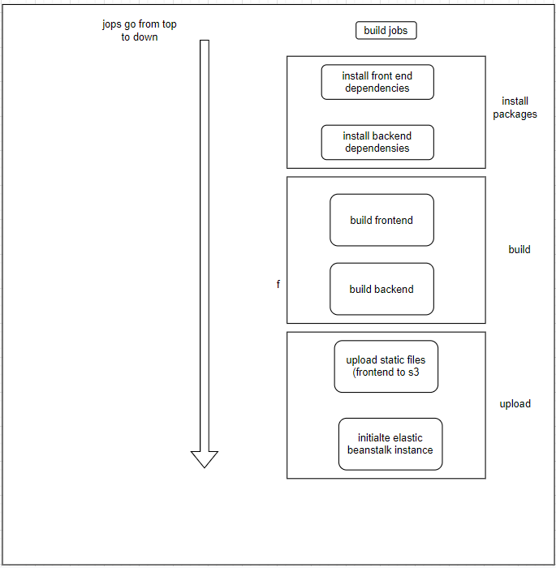

# Pipeline documentation

- we use CircleCi as our pipeline
- configration details

```yaml
version: 2.1
orbs:
  # orgs contain basc recipes and reproducible actions (install node, aws, etc.)
  node: circleci/node@5.0.2
  aws-elastic-beanstalk: circleci/aws-elastic-beanstalk@2.0.1
  aws-cli: circleci/aws-cli@3.1.1
  # different jobs are calles later in the workflows sections
jobs:
  build:
    docker:
      # the base image can run most needed actions with orbs
      - image: "cimg/node:14.15"
    steps:
      - checkout
      - node/install
      - aws-elastic-beanstalk/setup
      - aws-cli/setup
      # Use root level package.json to install dependencies in the frontend app
      - run:
          name: Install Front-End Dependencies
          command: npm run frontend:install
      - run:
          name: Install API Dependencies
          command: "npm run api:install"
      - run:
          name: Front-End Build
          command: "npm run frontend:build"
      - run:
          name: API Build
          command: "npm run api:build"

      - run:
          name: API deploy
          command: npm run api:deploy
      - run:
          name: Front-End deploy
          command: npm run frontend:deploy

filters:
  branches:
    only: -/main\/.*/
```

## the configration details has the following follows

- Frontend

  - Install
  - Build
  - Deploy

- Backend

  - Install
  - Build
  - Deploy

- GitHub for version control and share files
- CircleCI for ci cd

- Frontend: Executes the package.json file's build script. The assets are then uploaded to S3 using the AWS CLI.

- Backend: Runs the build script, then exports all CircleCI setup environment variables to a.env file before running the archive script. The archive is then uploaded to  
   S3 using AWS CLI.
  
